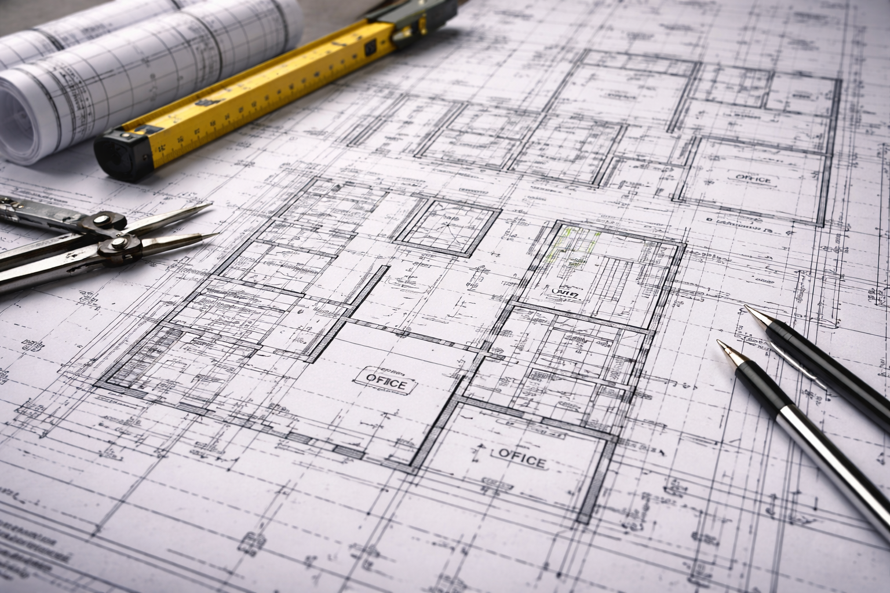

# Steel Moment Connection — 3D construct / deconstruct

A parametric AISC beam-to-column **moment connection** (welded flange, bolted
web — the WUF-W type) that assembles and explodes on demand. The geometry is
built from tabulated wide-flange data, tessellated to a single glTF, and shipped
with two baked animation clips.



## What's here

| File | Purpose |
|------|---------|
| `shapes_db.csv` | Subset of the AISC v15 Shapes Database (decimal dimensions). |
| `shapes.py` | Looks up a W-shape and builds a **filleted** cross-section, then extrudes it to a solid. |
| `parts.py` | Part builders — `column`, `beam`, `continuity_plate`, `doubler`, `shear_tab`, `backing_bar`, `bolt`, `weld_bead` — plus `moment_connection()` that assembles them in one world frame. |
| `export.py` | Tessellates every part, writes **one GLB** with a named node per part and two clips (`construct` / `deconstruct`). |
| `connection.glb` | The generated model (regenerate any time). |
| `viewer.html` | Self-contained `<model-viewer>` page with Construct / Deconstruct / Loop controls. |
| `vendor/model-viewer.min.js` | Vendored viewer runtime (no third-party CDN needed). |

## Modeled parts

- **W14×90 column** (strong-axis, flanges facing the beam)
- **W18×50 beam** framing into the column face, web drilled for the bolt line
- **Continuity plates** (top & bottom) inside the column at the beam-flange levels, notched around the web
- **Panel-zone doubler plate** on the column web
- **Shear tab** welded to the column flange, bolted to the beam web
- **Backing bars** under the top & bottom flange CJP welds
- **Four A325 hex bolts** (head + nut) through tab and web
- **Glowing CJP / fillet welds** (emissive, via `KHR_materials_emissive_strength`)

Everything is authored in **inches** (the native unit of the AISC tables) and
scaled to metres on export so the GLB is real-world size in any glTF viewer.

## Regenerate the model

```bash
pip install -r geometry/requirements.txt
python -m geometry.export        # writes geometry/connection.glb
```

## View it

Served over HTTP (model-viewer uses ES modules, so `file://` won't work):

```bash
python -m http.server 8000
# open http://localhost:8000/geometry/viewer.html
```

On the live site it's at `/geometry/viewer.html`.

## The animation

Both clips share a 12-second timeline. Parts move on a **staggered** schedule
keyed to assembly order (`Part.seq`): the column is the fixed anchor, then the
doubler, continuity plates and backing bars seat, then the shear tab, then the
beam slides home, the bolts drive in, and finally the welds scale up and glow.
`construct` runs parked → seated; `deconstruct` runs the reverse. To retarget the
connection to other shapes, edit `COLUMN_SHAPE` / `BEAM_SHAPE` and the geometry
constants at the top of `parts.py`.
